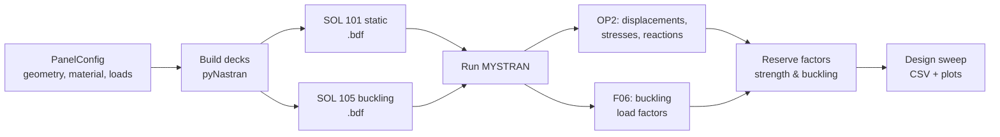
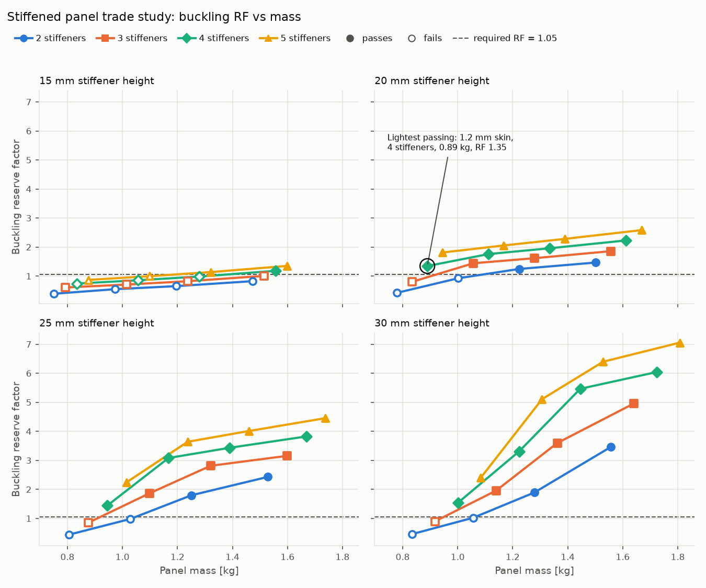
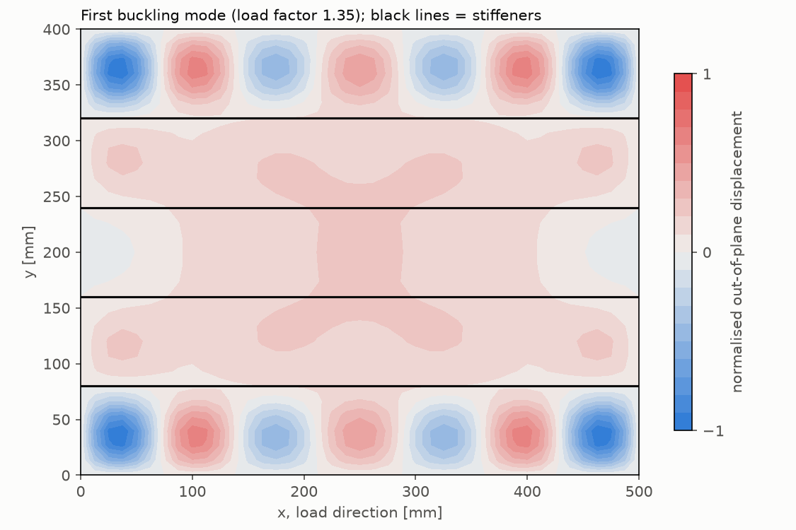

# Stiffened Panel Automation with Nastran

[](https://github.com/MianZhou21/nastran-panel-automation/actions/workflows/tests.yml)

A Python tool that automates the full finite element workflow for a stiffened
aircraft skin panel: it **builds Nastran input decks**, **runs the solver**,
**extracts results** and **sweeps design parameters** to find the lightest
panel that meets its buckling and strength requirements.

It is a personal project to transfer my Abaqus automation experience to the
Nastran toolchain used in aerospace. It uses
[pyNastran](https://github.com/SteveDoyle2/pyNastran) to read and write Nastran
files, and the open-source, Nastran-compatible solver
[MYSTRAN](https://github.com/MYSTRANsolver/MYSTRAN), so it runs without a
commercial licence. The decks are standard Nastran bulk data (SOL 101 / SOL 105).

## What it does



* **Model generation** – CQUAD4 skin, offset CBAR blade stiffeners, MAT1/PSHELL/PBAR
  properties, SPC1 boundary conditions, FORCE/MOMENT/PLOAD4 loads, EIGRL buckling method
* **Solver execution** – runs MYSTRAN from Python and raises a clear error on fatal messages
* **Post-processing** – peak displacement, skin von Mises and stiffener stress from the OP2
  file; buckling load factors from the F06; mass from the deck itself
* **Design sweep** – skin thickness × stiffener count × stiffener height, reserve factors,
  lightest passing design, then a re-check of that design on a 2× finer mesh
* **Tests** – 37 pytest tests, including comparisons against closed-form solutions, run on
  every push with GitHub Actions

## Results

Design sweep for a 500 × 400 mm Al 2024-T3 panel under a compressive end load of
100 N/mm: 4 skin thicknesses × 4 stiffener counts × 4 stiffener heights = 64 designs,
128 solver runs, about 5 minutes. A design passes if its strength RF ≥ 1.0 and its
buckling RF ≥ 1.05 (the 5% margin covers the mesh error, see below); 42 of 64 pass.



The lightest passing design is a **1.2 mm skin with four 20 mm stiffeners
(0.89 kg, buckling RF 1.35)**. Re-analysed on a 2× finer mesh its RF is 1.31, so it
still passes. Its first buckling mode is local skin buckling in the outer bays, between
the panel edge and the first stiffener:



The sweep also shows two different buckling modes, identified from how far the
stiffener lines move in each mode shape:

* **Local skin buckling** (as above): thin skin buckles between stiffeners that stay
  nearly straight.
* **Overall buckling**: once the skin is thick enough, or the stiffeners close enough,
  the skin bays are stronger than the stiffeners, and the stiffeners bend with the skin.

Short stiffeners make the switch happen early. With 15 mm stiffeners almost every design
buckles overall, so extra skin thickness barely raises the RF (the flat lines in the first
chart). With 30 mm stiffeners the skin can reach 2.0–2.5 mm before the mode switches. The
lightest design is mostly local skin buckling, with the stiffeners moving about 20% of the
peak displacement.

## Verification

Every modelling change is checked against hand calculations
(`tests/test_verification.py`):

| Check | Expected | Model | Difference |
|---|---|---|---|
| Square plate buckling, simply supported, k = 4 | 6.682 MPa | 6.661 MPa | −0.3% |
| 2:1 plate buckling (two half-waves), k = 4 | 15.035 MPa | 15.035 MPa | 0.0% |
| Uniform compression: skin and stiffener stress = P / A | 42.105 MPa | 42.105 MPa | < 0.01% |
| Pressure fully reacted: Σ reactions = p·a·b | 2000 N | 2000 N | < 0.01% |
| Panel mass vs hand calculation | exact | exact | – |

Mesh convergence for the lightest design (buckling load factor):

| Mesh (x × elements per bay) | 20 × 3 | **40 × 6 (default)** | 80 × 12 |
|---|---|---|---|
| Load factor | 1.492 | **1.347** | 1.307 |

The default mesh is about 3% above the finest mesh, and so slightly unconservative
(about 4% on other designs). That is why a design needs a buckling RF of at least 1.05 to
pass, and why the sweep re-checks the lightest design on a 2× finer mesh before reporting
it.

The tests also caught a real modelling error during development: the first version
restrained in-plane rigid-body motion at only one corner, which let the panel rotate
in its own plane. The 2:1 plate test returned a zero eigenvalue, and the fix was a
second restraint at the adjacent corner.

## Quick start

Requires Python 3.10+.

```bash
git clone https://github.com/MianZhou21/nastran-panel-automation.git
cd nastran-panel-automation
pip install -e ".[dev]"
pytest                       # solver tests are skipped if MYSTRAN is not found
```

To run the analyses, install MYSTRAN and point the tool at it:

```bash
export MYSTRAN_EXE=/path/to/mystran      # Windows PowerShell: $env:MYSTRAN_EXE="C:\path\to\mystran.exe"
pytest                                   # now runs all 37 tests
panel-sweep --out results                # design sweep, writes CSV and plots
```

**No solver installed?** Run the sweep on GitHub instead: **Actions** tab →
**run design sweep** → **Run workflow**. It builds MYSTRAN, runs all designs and
attaches the CSV, plots, `.bdf` and `.OP2` files to the run for download.

MYSTRAN is built from source on Linux / WSL (see its
[BUILD.md](https://github.com/MYSTRANsolver/MYSTRAN/blob/main/BUILD.md), or the
`verification-tests` job in `.github/workflows/tests.yml`, which does exactly that).
Check the MYSTRAN Releases page for prebuilt Windows executables.

Use it from Python:

```python
from panel_automation import PanelConfig, analyse_panel

cfg = PanelConfig(skin_thickness=1.6, n_stiffeners=3, compressive_line_load=100.0)
summary = analyse_panel(cfg, workdir="runs/example")
print(summary.mass_kg, summary.rf_buckling, summary.rf_strength)
```

## Project structure

```
src/panel_automation/
    config.py      panel geometry, material and loads (validated dataclasses)
    sections.py    blade stiffener section properties for PBAR
    model.py       builds SOL 101 and SOL 105 decks with pyNastran
    solver.py      runs MYSTRAN and checks for fatal errors
    results.py     reads OP2 (stresses, displacements) and F06 (buckling factors)
    pipeline.py    one panel end to end: decks -> solve -> reserve factors
    sweep.py       design sweep, CSV, plots and fine-mesh check of the lightest design
tests/
    test_model.py         deck content, loads, mass, round trip (no solver needed)
    test_results.py       F06 parser
    test_sweep.py         pass/fail rule, lightest design, CSV and plot (no solver needed)
    test_verification.py  results vs closed-form solutions (needs MYSTRAN)
```

## Modelling assumptions and limitations

* Linear static and linear (eigenvalue) buckling only: no post-buckling, plasticity or
  imperfections, so the buckling RF is an initial-buckling check.
* All four edges simply supported out of plane; frames and neighbouring panels are not
  modelled.
* Blade stiffeners are CBAR beams offset to their centroid. Local stiffener modes such as
  crippling or web buckling need shell stiffeners or hand methods and are not captured.
* The end load is applied as a uniform stress, with each stiffener's share acting at its
  own centroid, so the panel is loaded without eccentricity.
* The strength RF uses an illustrative yield-based allowable, not certified design values.

## Next steps

* Multiple load cases (compression + shear + pressure) in one run, with the governing
  RF reported per load case
* Stiffener crippling and column checks from standard hand methods
* Shell-modelled stiffeners (I, Z, hat sections) as an alternative to beams
* Checking the decks against MSC Nastran, and scripted pre-processing in HyperMesh (Tcl)

## Author

Mian Zhou, PhD – FE automation & simulation engineer · ML surrogate models.
[LinkedIn](https://www.linkedin.com/in/mian-zhou-44bb3819/)

Licensed under the MIT Licence.
